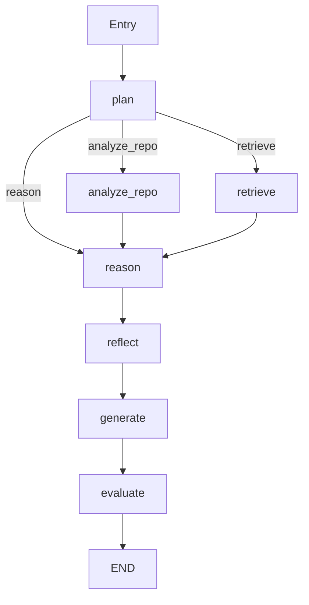

# LangGraph Workflow Orchestration

## Overview

LangGraph is the **state graph framework** that orchestrates the agent's workflow. It manages:
- **Node execution**: Which node runs when
- **State management**: Passing data between nodes
- **Conditional routing**: Dynamic workflow paths
- **Iteration control**: Preventing infinite loops

## Why LangGraph?

**Before (v1.0 - Sequential):**
```python
# Simple linear flow
repo_data = analyze_repo()
answer = generate_answer(repo_data)
return answer
```
**Limitations:**
- ❌ No loops or branching
- ❌ No conditional routing
- ❌ No state management
- ❌ Hard to add new nodes

**After (v2.0 - LangGraph):**
```python
# State graph with conditional routing
workflow = StateGraph(AgentState)
workflow.add_node("planner", planning_node)
workflow.add_node("retriever", retrieval_node)
workflow.add_node("reasoner", reasoning_node)
workflow.add_conditional_edges("planner", route_after_planning)
```
**Benefits:**
- ✅ Conditional routing based on task type
- ✅ Shared state across nodes
- ✅ Automatic iteration tracking
- ✅ Easy to add/remove nodes

## Architecture

### 1. Agent State (`state.py`)

**State is a TypedDict** that flows through all nodes:

```python
from typing import TypedDict, Annotated
import operator

class AgentState(TypedDict):
    # Core task
    task: str
    task_type: str  # "analyze_repo", "answer_question", "generate_post"
    
    # Repository analysis (populated by repo_analyzer)
    repo_structure: Optional[Dict]
    code_files: Optional[List[Dict]]
    dependencies: Optional[Dict]
    architecture: Optional[Dict]
    code_symbols: Optional[Dict]
    verification_outputs: Optional[Dict]
    
    # RAG context (populated by retriever)
    retrieved_context: Optional[List[Dict]]
    
    # Reasoning trail (accumulated)
    reasoning_steps: Annotated[List[str], operator.add]  # Auto-concatenate
    reflection_notes: Annotated[List[str], operator.add]
    reflection_assessment: Optional[str]  # "good" or "needs_improvement"
    
    # Generation
    output_before_reflection: Optional[str]
    final_output: Optional[str]
    
    # Evaluation
    evaluation_scores: Optional[Dict[str, float]]
    evaluation_explanations: Optional[Dict[str, List[str]]]
    
    # Control flow
    next_action: str  # Next node to execute
    iteration_count: int
    max_iterations: int
    is_complete: bool
```

**Key Features:**
- `Annotated[List[str], operator.add]`: Lists automatically concatenate when nodes return updates
- `Optional[Dict]`: Nodes can populate these as needed
- `next_action`: Dynamic routing key

### 2. Node Definitions

Each node is an **async function** that takes state and returns updated state:

```python
async def planning_node(state: AgentState) -> AgentState:
    """Analyze task and determine next action"""
    task = state["task"]
    task_type = state["task_type"]
    
    # Decision logic
    if task_type == "analyze_repo":
        if state.get("repo_structure") is None:
            next_action = "analyze_repo"  # Need repo data
        else:
            next_action = "reason"  # Have data, proceed
    elif task_type == "answer_question":
        next_action = "retrieve"  # Query knowledge base
    else:
        next_action = "reason"  # Generate content
    
    # Return state updates
    return {
        "next_action": next_action,
        "reasoning_steps": [f"Planning: Task is {task_type} → {next_action}"],
        "iteration_count": state["iteration_count"] + 1
    }
```

**All Nodes:**
1. **Entry** - Initialize state
2. **Planner** - Determine workflow path
3. **RepoAnalyzer** - Extract code symbols, run verification commands
4. **RAGRetriever** - Query ChromaDB knowledge base
5. **Reasoner** - Generate chain-of-thought reasoning
6. **Reflector** - Critical self-assessment
7. **Generator** - Produce final output
8. **Evaluator** - Score quality with explanations
9. **Exit** - Return final state

### 3. Workflow Definition (`orchestrator.py`)

```python
from langgraph.graph import StateGraph, END

def create_agent_workflow() -> StateGraph:
    """Build the LangGraph workflow"""
    
    # Initialize graph
    workflow = StateGraph(AgentState)
    
    # Add nodes
    workflow.add_node("plan", planning_node)
    workflow.add_node("analyze_repo", repo_analyzer_node)
    workflow.add_node("retrieve", retrieval_node)
    workflow.add_node("reason", reasoning_node)
    workflow.add_node("reflect", reflection_node)
    workflow.add_node("generate", generation_node)
    workflow.add_node("evaluate", evaluation_node)
    
    # Set entry point
    workflow.set_entry_point("plan")
    
    # Add conditional edges (routing logic)
    workflow.add_conditional_edges(
        "plan",
        route_after_planning,  # Function determines next node
        {
            "analyze_repo": "analyze_repo",
            "retrieve": "retrieve",
            "reason": "reason",
            "END": END
        }
    )
    
    # Add fixed edges (always go to next)
    workflow.add_edge("analyze_repo", "reason")
    workflow.add_edge("retrieve", "reason")
    workflow.add_edge("reason", "reflect")
    workflow.add_edge("reflect", "generate")
    workflow.add_edge("generate", "evaluate")
    workflow.add_edge("evaluate", END)
    
    return workflow.compile()
```

### 4. Conditional Routing

**Route after planning:**
```python
def route_after_planning(state: AgentState) -> str:
    """Determine next node based on plan"""
    next_action = state.get("next_action", "reason")
    
    # Check iteration limit
    if state["iteration_count"] >= state["max_iterations"]:
        print("⚠️ Max iterations reached")
        return "END"
    
    # Route based on next_action
    if next_action == "analyze_repo":
        return "analyze_repo"
    elif next_action == "retrieve":
        return "retrieve"
    elif next_action == "reason":
        return "reason"
    else:
        return "END"
```

**Key point:** Routing is **deterministic** based on state, not random

### 5. Iteration Control

**Prevent infinite loops:**

```python
# In orchestrator.py
async def run_agent(task: str, task_type: str, max_iterations: int = 1):
    """Execute agent workflow"""
    
    # Create initial state
    initial_state = create_initial_state(
        task=task,
        task_type=task_type,
        max_iterations=max_iterations  # Default: 1 (single pass)
    )
    
    # Run workflow
    workflow = create_agent_workflow()
    final_state = await workflow.ainvoke(initial_state)
    
    return final_state
```

**Why max_iterations=1?**
- v2.0 uses **single-pass workflow** (no loops)
- Planner → (Analyzer/Retriever) → Reasoner → Reflector → Generator → Evaluator
- Reflector **always** proceeds to Generator (no loop back to Planner)
- Prevents repeated reasoning and excessive output

## Execution Flow Examples

### Example 1: Repository Analysis

```
User: "Analyze this repository"
task_type: "analyze_repo"

Flow:
1. Entry → plan (iteration=0)
2. plan → analyze_repo (next_action="analyze_repo")
3. analyze_repo → reason (extract symbols, run pytest/coverage)
4. reason → reflect (generate 3-5 reasoning steps)
5. reflect → generate (critique: "needs_improvement")
6. generate → evaluate (produce BEFORE + AFTER outputs)
7. evaluate → END (score 95/100, show results)

Total nodes executed: 7
```

### Example 2: Knowledge Base Question

```
User: "What is self-reflection?"
task_type: "answer_question"

Flow:
1. Entry → plan (iteration=0)
2. plan → retrieve (next_action="retrieve")
3. retrieve → reason (query ChromaDB, get 5 chunks)
4. reason → reflect (analyze question + context)
5. reflect → generate (critique: "good")
6. generate → evaluate (single output with sources cited)
7. evaluate → END (score 90/100)

Total nodes executed: 7
```

### Example 3: LinkedIn Post Generation

```
User: "Write a LinkedIn post about this project"
task_type: "generate_content"

Flow:
1. Entry → plan (iteration=0)
2. plan → reason (skip analysis/retrieval)
3. reason → reflect (use cached repo data)
4. reflect → generate (critique: "needs_improvement")
5. generate → evaluate (BEFORE + AFTER with data-driven content)
6. evaluate → END (score 92/100)

Total nodes executed: 6
```

## State Updates & Merging

### Automatic List Concatenation

```python
# Node 1 returns
{"reasoning_steps": ["Step 1"]}

# Node 2 returns
{"reasoning_steps": ["Step 2"]}

# Final state has
{"reasoning_steps": ["Step 1", "Step 2"]}  # Merged!
```

**Why:** `Annotated[List[str], operator.add]` tells LangGraph to concatenate lists

### Explicit State Updates

```python
# Node returns partial state
new_state = {
    "next_action": "generate",
    "reflection_assessment": "needs_improvement",
    "reflection_notes": ["Missing class names"]
}

# LangGraph merges with existing state
# Only updates specified keys
```

## LangSmith Integration (Optional)

**Enable tracing:**

```python
import os
os.environ["LANGCHAIN_TRACING_V2"] = "true"
os.environ["LANGCHAIN_API_KEY"] = "your_key"
os.environ["LANGCHAIN_PROJECT"] = "simple-rag-v2"
```

**View in LangSmith:**
- Node execution times
- State at each step
- Errors and retries
- LLM calls and costs

**Example trace:**
```
Run: analyze_repo_2024-11-05
├─ plan (120ms)
├─ analyze_repo (2.3s)
│  ├─ extract_symbols (1.1s)
│  └─ run_pytest (1.2s)
├─ reason (3.5s)
│  └─ LLM call (3.4s, $0.02)
├─ reflect (2.1s)
│  └─ LLM call (2.0s, $0.01)
├─ generate (5.2s)
│  ├─ BEFORE (2.5s, $0.03)
│  └─ AFTER (2.7s, $0.03)
└─ evaluate (100ms)

Total: 13.3s, $0.09
```

## Advanced Features

### 1. Checkpointing (Future)

```python
# Save state at each node
workflow = create_agent_workflow(checkpointer=MemorySaver())

# Resume from checkpoint
final_state = await workflow.ainvoke(
    initial_state,
    config={"checkpoint_id": "checkpoint_123"}
)
```

### 2. Streaming (Future)

```python
# Stream node outputs as they complete
async for event in workflow.astream(initial_state):
    print(f"Node {event['node']} completed")
    print(f"State: {event['state']}")
```

### 3. Parallel Execution (Future)

```python
# Run analyzer and retriever in parallel
workflow.add_edges(
    "plan",
    ["analyze_repo", "retrieve"],  # Both execute simultaneously
    merge_strategy="union"  # Merge results
)
```

## Debugging

### Print State at Each Node

```python
async def planning_node(state: AgentState) -> AgentState:
    print(f"📊 Planning Node State:")
    print(f"   Task: {state['task']}")
    print(f"   Iteration: {state['iteration_count']}")
    # ... rest of logic
```

### Visualize Workflow

```python
# Generate Mermaid diagram
from langgraph.graph import StateGraph
workflow = create_agent_workflow()
print(workflow.get_graph().draw_mermaid())
```

Output:


### Debug Routing Decisions

```python
def route_after_planning(state: AgentState) -> str:
    next_action = state["next_action"]
    print(f"🔀 Routing: {next_action}")
    print(f"   Options: analyze_repo, retrieve, reason, END")
    print(f"   Chosen: {next_action}")
    return next_action
```

## Best Practices

### 1. Keep Nodes Focused
✅ **Good:** Each node does one thing (plan, retrieve, reason, etc.)  
❌ **Bad:** Mega-node that does planning + reasoning + generation

### 2. Use State for Communication
✅ **Good:** Store data in state, nodes read from state  
❌ **Bad:** Global variables or direct function calls between nodes

### 3. Always Set next_action
✅ **Good:** Every node sets `next_action` for routing  
❌ **Bad:** Undefined routing logic causes errors

### 4. Prevent Infinite Loops
✅ **Good:** `max_iterations=1`, reflector always goes to generator  
❌ **Bad:** Reflector can loop back to planner indefinitely

### 5. Handle Errors Gracefully
```python
async def retrieval_node(state: AgentState) -> AgentState:
    try:
        results = collection.query(...)
    except Exception as e:
        # Don't crash - return empty results
        return {"retrieved_context": [], "reasoning_steps": [f"Retrieval failed: {e}"]}
```

## Troubleshooting

### Issue: "Node X never executes"
**Cause:** Routing function doesn't return X as option  
**Solution:** Check conditional_edges mapping includes X

### Issue: "State not updating"
**Cause:** Node returns Dict, not Dict with correct keys  
**Solution:** Ensure returned dict has valid AgentState keys

### Issue: "Infinite loop"
**Cause:** Routing cycles back to earlier node  
**Solution:** Set `max_iterations=1` or fix routing logic

### Issue: "LangGraph not installed"
**Solution:**
```bash
pip install langgraph
```

## Performance

### Typical Execution Times
- **Simple query** (no analysis): ~5-8 seconds
- **Repository analysis**: ~15-20 seconds (pytest + coverage)
- **With coverage timeout**: ~60+ seconds

### Optimization Tips
1. **Skip coverage** if not needed: `SKIP_COVERAGE=true`
2. **Reduce max_files** in symbol extraction: `max_files=30`
3. **Cache repo data** between queries (already implemented)
4. **Use async** for parallel tool calls (future)

## Related Documentation

- [Agent State](./AGENT_STATE.md) - State structure details
- [Nodes](./NODES.md) - Individual node implementations
- [Routing Logic](./ROUTING.md) - Conditional edge functions
- [Architecture Diagram](./architecture-v2.mmd) - Visual workflow
